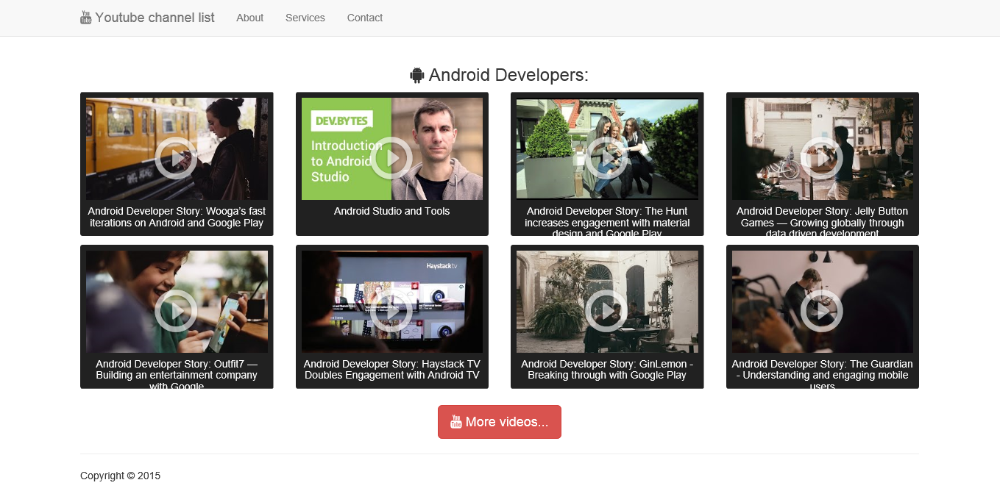

# Youtube Video List
Load videos automatically from selected Youtube channel with PHP and Youtube Data API v3

###To get videos by username modify the [list/youtube_video.php](list/youtube_video.php):
###1. Step:
Get channel for username, this contains ID for the "uploads" playlist. The "uploads" playlist contains all videos uploaded by user.
Documentation: https://developers.google.com/youtube/v3/docs/channels/list
###2. Step:
Create video list from the playlist.
Documentation: https://developers.google.com/youtube/v3/docs/playlistItems/list

##The code:

```php
//Get the id of "uploads"
//More info: https://developers.google.com/youtube/v3/docs/channels/list

$username = "{YOUR_USERNAME}"; //The username(example: johndoe)
$maxResults = 10;
$API_key = "{YOUR_API_KEY}";

$channel_list = json_decode(file_get_contents("https://www.googleapis.com/youtube/v3/channels?part=contentDetails&forUsername=".$username."&key=".$API_key.""));

$uploads_id = $channel_list->items[0]->contentDetails->relatedPlaylists->uploads;

//Get videos from playlist
//More info: https://developers.google.com/youtube/v3/docs/playlistItems/list

$list_items = json_decode(file_get_contents("https://www.googleapis.com/youtube/v3/playlistItems?part=snippet&maxResults=".$maxResults."&playlistId=".$uploads_id."&key=".$API_key.""));

foreach($list_items->items as $item)
{
	 echo '<li id="'. $item->snippet->resourceId->videoId .'" class="col-lg-3 col-sm-6 col-xs-6 youtube-video">
        <a href="#'. $item->snippet->resourceId->videoId .'" title="'. $item->snippet->title .'">
            snippet->thumbnails->medium->url .'" alt="'. $item->snippet->title .'" class="img-responsive" height="130px" />
            <h2>'. $item->snippet->title .'</h2>
            <span class="glyphicon glyphicon-play-circle"></span>
        </a>
    </li>
    ';
}
```




